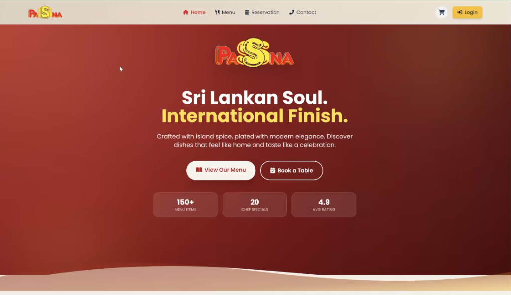
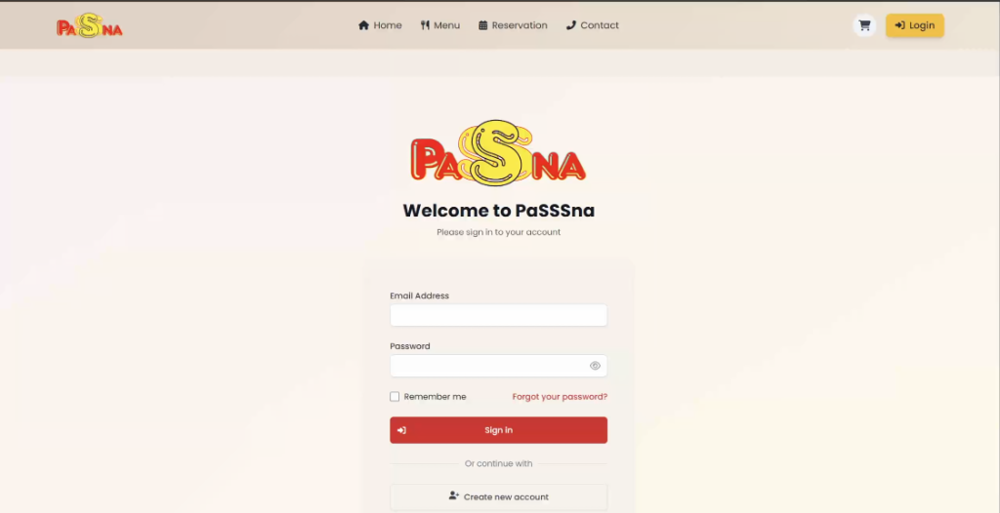
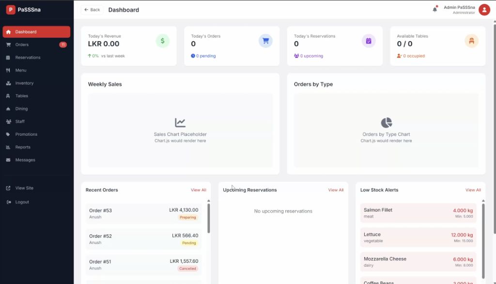

# 🍽️ PaSSSna Restaurant Management System


PaSSSna is a premium, fully-featured **Restaurant Management System** built on top of the Laravel framework. It provides a comprehensive solution for restaurant owners to manage menus, track orders, handle reservations, monitor inventory, manage staff, and generate PDF reports. It also offers a seamless and responsive customer interface for online ordering and dining reservations.

---

## 📸 Application Showcase

### 🏠 Customer Landing Page
*A premium, modern, and responsive interface for customers to browse the menu and book tables.*


### 🔑 Authentication Page
*Clean, interactive sign-in and account registration screens.*


### 📊 Admin Dashboard
*Comprehensive control center with real-time KPI metrics, charts, live orders, reservations, and inventory management.*


---

## 🌟 Key Features

### 💻 Customer Panel
*   **Authentication & Profiles:** Secure registration, login, and profile management.
*   **Interactive Menu:** Browse dishes with smart search, sorting, and category filters.
*   **Shopping Cart:** Easy-to-use checkout system supporting multiple payment methods.
*   **Order Tracking:** Live status tracking for delivery, takeaway, or dine-in orders.
*   **Table Booking:** Real-time table reservations with automated seat allocation.
*   **Meal Builder:** Custom meal builder interface for personalized dining options.

### 🛡️ Admin Dashboard
*   **Analytics & KPIs:** Interactive sales, orders, and reservation charts.
*   **Menu Management:** Full CRUD operations for menu items, categories, and tags.
*   **Order Operations:** Manage and update status of deliveries, takeaways, and dine-in orders.
*   **Reservation Control:** View, accept, decline, or reschedule table bookings.
*   **Inventory & Stock:** Kitchen ingredient/stock level tracking with low-stock alerts.
*   **Staff Management:** Manage employee roles, attendance, and details.
*   **Promotions Engine:** Create and manage discount codes, active offers, and banners.
*   **PDF Reports:** Export sales, orders, and inventory reports directly to PDF.

---

## ⚙️ Tech Stack & Architecture

*   **Backend:** Laravel 10 / PHP 8.1+
*   **Frontend:** Tailwind CSS, Blade Templates, JavaScript
*   **Build Tool:** Vite
*   **Database:** MySQL 8.0+
*   **PDF Generation:** DomPDF

---

## 🚀 Quick Setup Guide

### 1. Prerequisites
Ensure you have the following installed:
*   PHP 8.1 or higher
*   Composer
*   MySQL 8.0+
*   Node.js (v18+) & npm

### 2. Installation
Follow these commands to get your local server running:

```bash
# Clone the repository
git clone https://github.com/your-username/PaSSSna-Restaurant.git
cd PaSSSna-Restaurant

# Install PHP dependencies
composer install

# Install Frontend dependencies
npm install

# Setup Environment config
copy .env.example .env

# Generate Application Key
php artisan key:generate
```

### 3. Database Configuration
Open your `.env` file and configure your local database credentials:

```env
DB_CONNECTION=mysql
DB_HOST=127.0.0.1
DB_PORT=3306
DB_DATABASE=passsna_restaurant
DB_USERNAME=root
DB_PASSWORD=your_mysql_password
```

Create the database in MySQL:
```sql
CREATE DATABASE passsna_restaurant;
```

Run migrations and seed default data:
```bash
php artisan migrate --seed
```

### 4. Run the Application
Link the storage folder:
```bash
php artisan storage:link
```

Start the servers:
```bash
# Terminal 1 - Laravel server
php artisan serve

# Terminal 2 - Frontend compiler
npm run dev
```

Visit the application at `http://127.0.0.1:8000`.

---

## 🔑 Default Admin Credentials

For testing and administrative access, use the following credentials:

*   **Email:** `admin.passsna@gmail.com`
*   **Password:** `PaSSSna_log`

---

## 🗄️ Database Schema Overview

The database contains the following key tables:
*   `users` — Core user accounts (Customers and Admins)
*   `menu_items` — Restaurant dishes, prices, and photo links
*   `orders` & `order_items` — Cart orders and breakdown
*   `tables` & `reservations` — Seat layouts and booking logs
*   `inventory` — Kitchen ingredients and stock levels
*   `staff` — Employee schedules and credentials
*   `promotions` — Discount codes and campaigns

---

## 📄 License

This project is licensed under the MIT License - see the [LICENSE](LICENSE) file for details.
